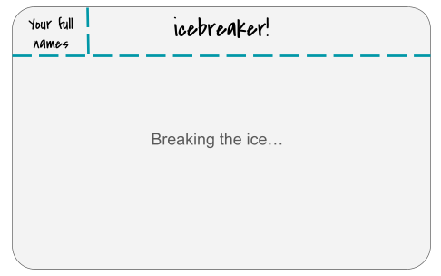
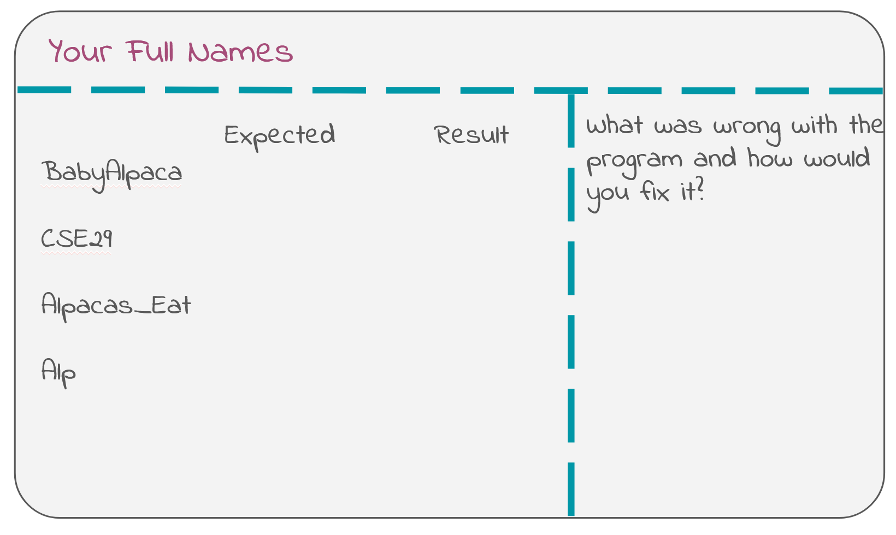

# Lab 3: Debugging with GDB
In this lab, you will get hands-on experience using GDB to debug C programs. GDB will become an essential tool for your PA work as this course develops, so lock in\!

## Lab 3 learning objectives

* Recognize the need for debugging using a debugger
* Compile a C program for debugging
* Catch possible bugs using a compiler
* Run a program in GDB while stopping at breakpoints
* Use various GDB commands to observe and control program execution
* Use GDB to troubleshoot a crashing program


# Whiteboard activity #1

## Icebreaker
The CSE 29 genie, which runs on ieng6, would like to grant you 3 wishes. You may wish for anything you want, except you may not wish recursively (i.e., wish for more wishes). What do you wish for?


## Warm-up

<div class="exercise">


Please write each other's icebreaker answers on your whiteboard as well.

</div>



## Color ls
1. if you did not opt to make your `ls` colorful in [week1](../week1/index#ls---looking-around), now is the time.  
1. Run `echo alias ls=\"ls --color\" >> ~/.bash_profile`  
    - if you have file permission issues, you can use `chmod u+rwx ~/.bash_profile`
1. you can use `source ~/.bash_profile` to apply these changes right now.


# Part 1: <span style="color:red">-W(arn)all</span> 
Our compiler `gcc` is designed to catch possible errors at compile time and warn you. While it gives you some of these warnings by default, we can force it to display all possible errors it detects by telling it to W(arn) all using `-Wall` flag. We can add this flag as follows:  
`gcc myprogram.c -o myprogram -Wall`  

<div class="note">

The order of flags given to `gcc` does not matter. The only space-seperated string where the order matters is if the flag is followed by an argument. `-o` is followed immediately by what the binary file should be named as.

</div>


<div class="exercise">

Using [**this repository**](https://classroom50.org/ucsd-cse29-fall2026/cse29-fa26/assignments/lab3/accept) navigate to the `Wall` directory and fix the programs. All bugs will be reported by compiliing using the `-Wall` flag

</div>

# Part 2: What and why debugging?

Debugging is the practice of finding and fixing errors in programs. There are no *real* bugs in your program, although [this has actually happened at least once before](https://en.wikipedia.org/wiki/Debugging#Etymology).

Like programming, debugging is also an incremental process. Programmers often need to isolate and debug one error at a time, rather than all errors at once.

We *could* insert some print statements into our code to try and figure out what’s going on—for small programs, print statements are often enough\! However, there are several situations where we would want to use a debugger instead:

1. If your program reports a segmentation fault, it can be difficult to pin down exactly where the segfault took place using print statements. A debugger can pause your program when it crashes and enable you to inspect its final state.
2. If you are searching for a bug in a loop with many iterations, searching through print statement output from that loop can be quite cumbersome.
3. You might work on a program for which you can't see the output of print statements (like your web browser or vim itself). In this case, the debugger is a convenient tool for inspecting program state.

GDB (**G**NU Project **D**e**b**ugger) is a command line program that offers a convenient way for us to pause execution at any point in the code, manually inspect the values of any variable in the scope, and walk through the program step-by-step.

# Debugging Activity

The `gdb` directory contains several programs which we will debug with GDB: `index_of_E` and `charshift.c`. We’ll start with the `index_of_E` program to introduce basic GDB commands, then look at `charshift.c` to talk about segmentation faults and how to debug them with GDB.


The correct behavior of `index_of_E` is to find the index of the first occurrence of the character `E` in a string `str`. 

<div class="exercise">

Predict the output for the following strings, "Baby_Alpaca", "CSE29", "Alp" and "Alpacas_Eat". Fill out your whiteboard, leaving some extra space for your later bug fix like so:

</div>



## Compiling for GDB

In order to use GDB, we have to compile our program with the `-g` flag. This tells the compiler to add some extra information to your executable file, which GDB will use. `index_of_E` was compiled using the following command.

```shell
$ gcc -o index_of_E -g index_of_E.c
```

## Running in GDB

To run the program in GDB, use the `gdb` and pass the program as an argument:

```shell
$ gdb ./index_of_E
```

This will spit out several lines of text, with some software and legal information that we don’t need to worry about. In the last line, you should notice that the terminal command prompt `$` (as well as the other stuff before `$`) has been replaced by the GDB command prompt `(gdb)`. This means that the GDB program is active and ready to receive commands.

Use the `run` command to **run** the program in GDB. Since this program takes in a command line argument, you can provide it like so:

```shell
(gdb) run CSE29_is_fantastic!
```
This is just like running the command `./index_of_E CSE29_is_fantastic!`. For now, it runs through the program without stopping. GDB might say something here about “Missing separate debuginfos”, but don’t worry about this. GDB is just asking to install some extra packages to get more information for debugging, but these aren’t necessary for our purposes right now.

To **quit** out of GDB, you can use the `quit` command.

```shell
(gdb) quit
```

<div class="important">

In the future, please add `-Wall` to your compilation command to ask the compiler to help you find potential bugs.

</div>


## Breakpoints

To pause execution at some point in the program, we have to set a **break***point*. Restart `gdb ./index_of_E`. Use the `break` command and give it a location in the source code that you want to pause execution at. At the moment, we’re not too sure exactly which part of the code is wrong, so we’ll pause at the beginning (the main function) and go step-by-step from there. You can use either

```shell
(gdb) break main
```

to automatically set a breakpoint wherever the main function is. which happens to be line 12 in `index_of_E.c`, or if you had the source code and knew the line number:  

```shell
(gdb) break index_of_E.c:12
```

to set a breakpoint at line 12 in the file `index_of_E.c`, You can set breakpoints at any line in a source file, but usually we find it helpful to set them at the start of functions, to investigate the behavior of a function from its beginning.

You can use the `info breakpoints` command to list out which breakpoints have been set, as well as some information about where they are and what their associated number is. You can delete breakpoints with the command `delete <number>` where `<number>` is the number associated with the breakpoint.

After setting a breakpoint, you can run the program again (copy the `run` command from earlier) and see that it pauses execution right where the breakpoint is.

# Part 3: TUI, Commands, Segfault, and BackTrace

## TUI in GDB

Notice that GDB printed out a single line of code from the source file. This is the line of code that is about to be executed next. Here, you can use the `list` command to print out some of the surrounding code. This can be helpful to contextualize where the code is running.

The `layout src` command may also be helpful to enable a TUI (Text User Interface) for GDB that automatically renders a portion of the source code in the top half of the screen. The highlighted line in the TUI shows which line of code is to be executed next. To disable the TUI, use `tui disable`. Alternatively, press `Ctrl` \+ `X`, followed by `A`.

```shell
(gdb) layout src
```

The TUI won’t render any source code unless there is a program that is active, i.e. in the middle of execution.

Sometimes the TUI can get messed up if the program prints something out (which `index_of_E` does). When this happens, try using the `refresh` command to refresh the TUI and hope that it will restore its correct format. If something seems *really* messed up, try disabling and re-enabling the TUI. 

On the left hand side of the TUI, you can see that the breakpoint is marked with `B+>`.

## Basic GDB commands

After setting a breakpoint and running, execution is paused right after we enter the main function, before any other code is executed. You can verify this by using the `print` command to print out the contents of the variable `result`:

```bash
(gdb) print result
```

and see that it contains an uninitialized value. We see this because the line that initializes the variable has not been executed yet.

To run the **next** line of code, we use the `next` command:

```shell
(gdb) next
```

The highlighted line has moved on, indicating that the previous line has been executed. You can check the values of `argc` and `argv` using the `print` command, which accepts any valid expression in C:

```shell
(gdb) print argc
(gdb) print argv
(gdb) print argv[0]
(gdb) print argc < 2
```

Let the program finish by using the `continue` command. Does its output match what you expect?

We now know that this input exposes a bug inside `index_of_E`, so we want to look into this function with GDB. Let’s restart the execution and make line-by-line steps. Run the `break main` command to have the program stop when the `main` function begins, and then use the `run` command to start the program again.

Use `next` to execute the program up until, but not actually executing, the call to `index_of()`. You’ll know that `index_of()` is next to be executed, but not executed yet, when the line of code is highlighted. This time, instead of using `next` to run the entire `index_of()` function at once, use the `step` command to **step** into the function and begin executing line-by-line from inside:

```bash
(gdb) step
```

<div class="note">

GDB also provides shortcuts for some commonly used commands, which can be used in place of the full command name. Some of those include: `r` for `run`, `q` for `quit`, `b` for `break`, `p` for `print`, `n` for `next`, and `s` for `step`.

In addition to shortcuts, inputting no command and pressing `Enter` will automatically execute the most recently used command. This can be helpful when you need to use `next` repeatedly.

</div>

Then continue using `next` to run through the loop and figure out why `index_of()` is buggy. Try printing out the relevant variables as you go through each iteration. Once you figure out why `index_of()` isn’t working, write what the problem was along with how you would fix it on your whiteboard.

<div class="checkoff">

Ask a staff member to check the fix for `index_of_E` on your whiteboard.

</div>

This buggy program demonstrated an example of a logical error. A logical error is one in which the behavior of the program is different than what we expect it to be, without refusing to compile or crashing at runtime. However, before your fix, it was theoretically possible for this program to crash—why do you think it was? Feel free to verify your thoughts with your peers, tutors or TA.


<div class="note">

When you tried to print `str` inside `index_of_E`, GDB printed the entire string, just as we expected. However, what if you want to print the contents of an integer array passed into a function?

If you'd like, try this with `contains.c` from our previous labs (you can `wget` our version if you don't have one—visit Lab 2's instructions for the command). When you try printing out `arr` like you did while in `main()`, you’ll realize that it prints out some hexadecimal number, instead of its contents. This happens because `arr` is passed into `contains()` as a pointer to the start of the array. The hexadecimal number you see is the address of the start of the array. You can use `print *arr` (`arr` with the dereference operator `*`) to dereference the pointer and get the value at the start of the array, or `print *arr@NUM` to print out the values stored at address `arr` and the next `NUM` addresses. This means you can use `print *arr@6` to print out all of the contents of the size 6 array.

</div>

## Segfault and Backtrace

Another common type of error is a *segmentation fault* (or just *segfault*). Segmentation faults can happen when we try to access someplace in memory illegally (yes, that’s the technical term). In `charshift.c`, we’ll look at an example of that.

Compile `charshift.c` for GDB and try running `./charshift`. It should immediately crash and give you a `Segmentation fault (core dumped)` error, telling you that some kind of illegal memory access happened. Most unhelpfully, the error message does not care to tell you why or even where it happened. Somewhat helpfully, GDB can at least answer the “where”. **From this lab onward, whenever you see your program segfaulting, you should consider debugging it with GDB.**

Start GDB with the `charshift` program. This time, instead of setting a breakpoint, we can let the program run through and give us a segmentation fault. GDB immediately tells us where the segfault happened and gives us a line number. From the output, we can see that the segfault occurred in `shift_chars()`, where we attempt to dereference the pointer and see if it is in the range of capital letters. But `main()` calls `shift_chars()`, so which one is the one causing the error?

Here, we can use the `backtrace` command (or the shorter `bt`) to show a **backtrace** (also called a stack trace) of the functions that were called leading up to the segfault. The output shows that the segfault happened in `shift_chars()`, when `shift_chars()` was called from `main()` at a certain line. This helps you discern which specific call to a function causes a segfault, when you have multiple calls to the same function. Feel free to run `layout src` to help you find the line referenced from the backtrace.

Since we know that segfaults are caused by illegal memory access, and we know that line 6 in `charshift.c` caused a segfault, we can infer that `ch` probably contains an address that the program can't access legally. Confirm this by running `print ch`. Then, run `print str` to see the address of the beginning of the message. What do you notice between these two addresses, and what does that imply about the loop in `shift_chars`? This should help you pinpoint and fix the bug. Feel free to work with your peers and ask your tutors/TAs for a hint if you're stuck\!

## Debugging practice

<div class="exercise">

There are 3 buggy programs in the `gdb` directory with names `buggy*.c`.
Use what you have learned in this lab to fix these programs.

</div>


# Identify yourself to ieng6

With this setup, each time you log in to your `ieng6` account, you have to type the password. This can get a bit tedious. Luckily, there is a cool and interesting way to avoid this while still staying secure using SSH keys. **You should perform the following on the device your frequently ssh into `ieng6` from, not particularly on a lab computer.**

1. Verify that you are **not** logged into `ieng6`. If your prompt does not contain the string `ieng6`, then you're probably not on it.
2. Run `ssh-keygen -t rsa -b 4096`. This command will generate a pair of SSH keys for you: one public (ends in .pub) and one private.
   If the program claims that the keys already exist, answer the `Overwrite (y/n)?` prompt with `n` to prevent overwriting your existing keys. Otherwise, keep pressing `<Enter>` until the program shows some text it calls the "randomart image".
3. Expand the instructions that match your system below:

<details>
    <summary>
        <strong>If your prompt ends with $ or % or #, not > (macOS, WSL, Linux)</strong> (Click to show instructions)
    </summary>
    Run <code>ssh-copy-id <span class="code-replace-me" contenteditable>username</span>@ieng6.ucsd.edu</code>, and enter your password (one last time). The program should claim that it has installed your key.
</details>
<details>
    <summary>
        <strong>If your prompt ends with > (Windows)</strong> (Click to show instructions)
    </summary>
    <ol>
        <li>Log into ieng6 with <code>ssh</code> (using your password as usual)</li>
        <li>Run <code>mkdir -p .ssh</code> in the terminal</li>
        <li>Log out of your remote account by pressing <kbd>Ctrl</kbd>+<kbd>D</kbd> or typing <code>exit</code>.</li>
        <li>On your local machine, run the following command:<br />
           <code>type $env:USERPROFILE\.ssh\id_rsa.pub | ssh <span class="code-replace-me" contenteditable>username</span>@ieng6.ucsd.edu "cat >> .ssh/authorized_keys"</code><br />
           (Credit to <a href="https://chrisjhart.com/Windows-10-ssh-copy-id/">Christopher Hart</a> for this convenient command. Please note if the above command does not work, copy in your full path to the SSH key)
        </li>
    </ol>
</details>

Try to log onto your remote account again. **You shouldn’t be prompted for a password anymore.** If you are, ask for help and carefully review the steps above with your group.

# Next steps

If you finish with the lab content above you may any do the following:
* Continue reading and get a sneak-peak on topics covered in lab 4! 👀
* Work on PA2?

